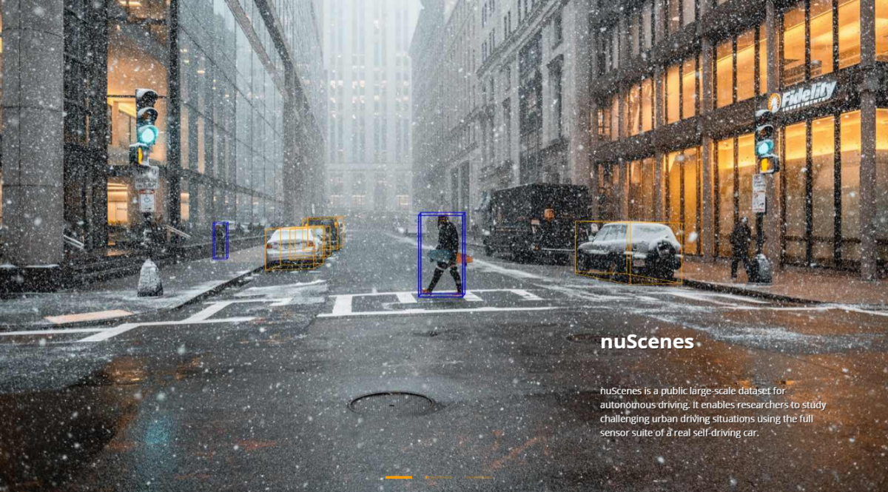

# Multimodal Pedestrian Detection with Cross-Attention

This work studies front-view 2D pedestrian detection on
[nuScenes](https://www.nuscenes.org/nuscenes), using `CAM_FRONT` and
projected `RADAR_FRONT` points.

The model employed in this repository studies multimodal pedestrian
detection on camera and Radar. It compares different cross-attention
techniques. Both models use a frozen DINOv3 ConvNeXt-Tiny camera encoder
and an MLP that encodes each Radar point into a token. A CenterNet
decoder then predicts a center heatmap, box size, and sub-cell offset.



## Models

**Camera encoder.** Frozen DINOv3 ConvNeXt-Tiny. Feature maps: s4, s8, s16.

**Radar encoder.** Each projected point is encoded into a token. Image-plane
position and physical measurements are encoded separately and added.

**Cross-attention variants.** Camera features are queries. Radar tokens are
keys and values.

- **V1: global cross-attention** — one fusion block at s16. Every camera cell
  attends to all Radar points. Decoder laterals at s8/s4 are camera-only.
- **V2: windowed cross-attention** — independent fusion blocks at s4, s8, and
  s16. Each `5 × 5` window attends to points in that window and its vertical
  neighbors. Empty windows skip attention. Decoder laterals are fused at every
  scale. A relevance head weights Radar values; a balanced BCE loss supervises
  it from 3D pedestrian boxes.

| | V1 | V2 |
| --- | --- | --- |
| Attention | Global, s16 | Windowed, s4 / s8 / s16 |
| Keys / values | All Radar points | Occupied windows + vertical neighbors |
| Empty Radar | Null token | Camera residual |
| Decoder | Fused s16, camera s8/s4 | Fused s4, s8, s16 |
| Loss | CenterNet | CenterNet + Radar relevance |

## Source files

Shared: [`camera_encoder.py`](src/model/camera_encoder.py),
[`postprocess.py`](src/model/postprocess.py).

| | V1 | V2 |
| --- | --- | --- |
| Detector | [`detector.py`](src/model/detector.py) | [`detector_v2.py`](src/model/detector_v2.py) |
| Radar encoder | [`radar_encoder.py`](src/model/radar_encoder.py) (`null_token`) | [`radar_encoder_v2.py`](src/model/radar_encoder_v2.py) (relevance head) |
| Fusion | [`fusion.py`](src/model/fusion.py) | [`point_window_fusion.py`](src/model/point_window_fusion.py) |
| Decoder | [`decoder.py`](src/model/decoder.py) | [`decoder_v2.py`](src/model/decoder_v2.py) |
| Loss | [`loss.py`](src/model/loss.py) | [`loss_v2.py`](src/model/loss_v2.py) |
| Train | [`train.py`](src/training/train.py) | [`train_v2.py`](src/training/train_v2.py) |

## Notebooks

| Notebook | Contents |
| --- | --- |
| [`src/notebooks/eda.ipynb`](src/notebooks/eda.ipynb) | Dataset EDA: annotations, `CAM_FRONT`, projected Radar |
| [`src/notebooks/v1.0_trainval_parts1_2.ipynb`](src/notebooks/v1.0_trainval_parts1_2.ipynb) | Audit of the part 1+2 blob: available scenes, split, experimental protocol |
| [`src/notebooks/evaluation_v1.ipynb`](src/notebooks/evaluation_v1.ipynb) | Full V1 evaluation: metrics, Radar ablation, qualitative predictions |
| [`src/notebooks/evaluation_v2.ipynb`](src/notebooks/evaluation_v2.ipynb) | Full V2 evaluation: metrics, Radar ablation, relevance, window fusion |

## Dataset

Use nuScenes `v1.0-trainval` metadata plus the part 1 and part 2 file blobs
(85 scenes each). Merge them at the repository root:

```text
v1.0-trainval-parts1-2/
├── maps/
├── samples/
├── sweeps/
└── v1.0-trainval/
```

Scene manifests in `src/config/splits/` define a fixed split:

| Split | Scenes | Notes |
| --- | ---: | --- |
| Train | 136 | `frame_stride: 2` by default |
| Validation | 34 | Checkpoint selection, early stopping, and evaluation |

All camera-visible pedestrians are kept; there is no 40 m distance cutoff.
Dataset archives, checkpoints, and outputs are gitignored.

## Setup

Python 3.12+ and [uv](https://docs.astral.sh/uv/):

```bash
git clone https://github.com/kuowilliam/imec.git
cd imec
uv sync
```

DINOv3 weights download from Hugging Face on the first run. `HF_TOKEN` is
optional, but avoids unauthenticated rate limits.

Settings live in [`src/config/config.yaml`](src/config/config.yaml). Defaults
point at the V2 checkpoint paths and the combined part 1/part 2 dataroot.

## Usage

Train V2:

```bash
uv run python src/training/train_v2.py
```

Training logs detection loss and Radar relevance loss, validates every
`validation_interval` epochs, saves the best checkpoint by validation
`mAP50:95`, and early-stops on that metric.

Evaluate the V2 checkpoint:

```bash
uv run python src/evaluation/evaluate.py
```

This reports AP50, AP75, mAP50:95, and precision/recall at the configured
score, and writes prediction overlays under `evaluation.output_dir`. The
postprocess score is kept low so AP can rank many candidates; the separate
report threshold is the operating point for precision and recall.
