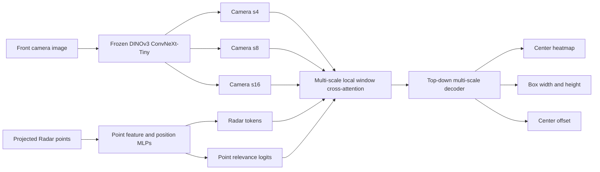

# Sparse Camera–Radar Pedestrian Detection on nuScenes

An end-to-end multimodal perception project for front-view pedestrian
detection using the nuScenes camera and automotive Radar data. The repository
contains the complete pipeline from dataset loading and projected Radar-point
processing to model training, validation, inference, evaluation, and
visualization.

The project was developed as an exploration of sparse multimodal learning for
physical AI and edge robotics. It includes both an initial global
cross-attention baseline and a second architecture that performs sparse local
camera–Radar fusion at multiple feature resolutions.

## Highlights

- Front-view 2D pedestrian detection using `CAM_FRONT` and `RADAR_FRONT`.
- Frozen DINOv3 ConvNeXt-Tiny camera backbone with multi-scale feature maps.
- Point-based Radar representation; Radar is not rasterized for model input.
- CenterNet-style heatmap, box-size, and center-offset prediction heads.
- Two model versions showing the evolution from global to sparse local fusion.
- Scene-level train/validation split with validation-based checkpointing and
  early stopping.
- Standard AP evaluation through TorchMetrics and qualitative prediction
  visualization.
- Reproducible Python environment and commands using uv.

## Architecture



Each Radar point is represented by seven values:

```text
[projected_u, projected_v, depth, RCS, vx_comp, vy_comp, time_lag]
```

Image-plane position and physical Radar measurements are encoded separately
and combined into point tokens. This keeps spatial correspondence explicit
while retaining depth, reflectivity, compensated velocity, and sweep timing.

### Model versions

| Version | Fusion design | Purpose |
| --- | --- | --- |
| V1 | Global cross-attention at the s16 camera feature map | Establishes a simple camera–Radar attention baseline. |
| V2 | Radar relevance supervision and occupied-window cross-attention at s4, s8, and s16 | Reduces unnecessary attention, preserves high-resolution localization, and makes Radar use directly measurable. |

In both versions, camera features query point-based Radar tokens. V2 assigns
Radar points to local camera windows, optionally includes vertically adjacent
windows, and only evaluates occupied windows. Relevance probabilities weight
the Radar value path, while an auxiliary balanced binary loss supervises which
points support pedestrian detection.

Attention is used because the current task is sparse spatial correspondence
between camera cells and Radar points. State-space models were considered, but
not added solely for novelty: their long-sequence advantage is more relevant
to a future temporal extension over multiple frames or scenes.

## Dataset

The project uses the [nuScenes dataset](https://www.nuscenes.org/nuscenes) and
the [nuScenes devkit](https://github.com/nutonomy/nuscenes-devkit). The current
configuration expects:

- nuScenes `v1.0-trainval` metadata;
- file blobs for 85 scenes, part 1;
- file blobs for 85 scenes, part 2.

Merge the downloaded archives into one directory at the repository root:

```text
v1.0-trainval-parts1-2/
├── maps/
├── samples/
├── sweeps/
└── v1.0-trainval/
```

The committed scene manifests define a deterministic split:

| Split | Scenes | Usage |
| --- | ---: | --- |
| Train | 136 | Parameter optimization; `frame_stride: 2` by default |
| Validation | 34 | Checkpoint selection, early stopping, and evaluation |

All camera-visible pedestrian annotations are eligible; the loader does not
apply a fixed 40 m distance cutoff. Dataset archives, checkpoints, and outputs
are intentionally excluded from Git.

## Environment

The project requires Python 3.12 or newer and uses
[uv](https://docs.astral.sh/uv/) for dependency and environment management.

```bash
git clone https://github.com/kuowilliam/imec.git
cd imec
uv sync
```

`uv sync` creates the local virtual environment and installs the exact locked
dependencies from `uv.lock`. The main libraries are PyTorch, timm,
nuScenes-devkit, TorchMetrics, and JupyterLab.

The DINOv3 backbone weights are downloaded through the Hugging Face Hub on the
first run. Setting `HF_TOKEN` is optional but avoids unauthenticated download
rate limits.

## Configuration

Runtime settings live in [`src/config/config.yaml`](src/config/config.yaml).
The main options include:

- image resolution and sensor channels;
- nuScenes root, version, and scene manifests;
- Radar sweep count;
- local fusion window and neighboring-window settings;
- Radar relevance loss weight;
- training, validation, checkpoint, and evaluation paths.

The default configuration targets the V2 model and the combined part 1/part 2
dataset directory shown above.

## Usage

### Explore the dataset

```bash
uv run jupyter lab
```

Open `src/notebooks/eda.ipynb` for dataset statistics, annotations, camera
views, and projected Radar-point exploration.

### Train V2

```bash
uv run python src/training/train_v2.py
```

Training reports detection and Radar-relevance losses, evaluates the fixed
validation split at the configured interval, saves the best checkpoint by
validation `mAP50:95`, and applies early stopping.

The original V1 training entry point remains available at
`src/training/train.py`. Change the checkpoint and history names in the config
before running V1 so that V2 artifacts are not overwritten.

### Evaluate and visualize V2

```bash
uv run python src/evaluation/evaluate.py
```

The evaluator reports:

- AP50;
- AP75;
- mAP50:95;
- precision and recall at the configured operating score;
- saved prediction/ground-truth visualizations.

Metrics and images are written under the configured `evaluation.output_dir`.
The low postprocessing threshold is intentional: confidence candidates are
retained for AP ranking, while the separate report threshold defines the
precision/recall operating point.

## Repository structure

```text
.
├── README.md
├── pyproject.toml
├── uv.lock
├── docs/
│   └── superpowers/              # V2 architecture design and implementation plan
└── src/
    ├── augmentation/             # Synchronized camera/Radar augmentation
    ├── config/
    │   ├── config.yaml           # Dataset, model, training, and evaluation settings
    │   └── splits/               # Fixed scene-level manifests
    ├── data_loader/
    │   ├── nuscenes_front_loader.py
    │   ├── radar_loader.py       # Projection and point relevance targets
    │   └── rasterization.py      # Earlier raster representation experiments
    ├── evaluation/
    │   ├── evaluate.py
    │   ├── metrics.py
    │   └── visualization.py
    ├── model/
    │   ├── camera_encoder.py
    │   ├── radar_encoder.py
    │   ├── detector.py           # V1 detector
    │   ├── fusion.py             # V1 global fusion
    │   ├── decoder.py            # V1 decoder
    │   ├── loss.py               # V1 CenterNet loss
    │   ├── detector_v2.py        # V2 detector
    │   ├── point_window_fusion.py
    │   ├── decoder_v2.py
    │   ├── loss_v2.py
    │   └── postprocess.py
    ├── notebooks/
    │   └── eda.ipynb
    ├── training/
    │   ├── train.py              # V1 training entry point
    │   └── train_v2.py           # V2 training entry point
    └── utils/
```

## Scope and limitations

- The detector currently covers the front view and the pedestrian class only.
- Only `RADAR_FRONT` is enabled in the default experiment.
- Detection is camera-plane 2D detection, not nuScenes 3D detection.
- The frozen camera backbone keeps training feasible on limited local
  hardware, but constrains domain adaptation.
- The 170-scene split is intended for controlled architectural experiments,
  not a claim of official nuScenes benchmark performance.

The next analysis layer belongs in evaluation notebooks: learning curves,
qualitative failure cases, Radar masking/shuffling ablations, relevance
quality, attention sparsity, and latency comparisons between V1 and V2.
